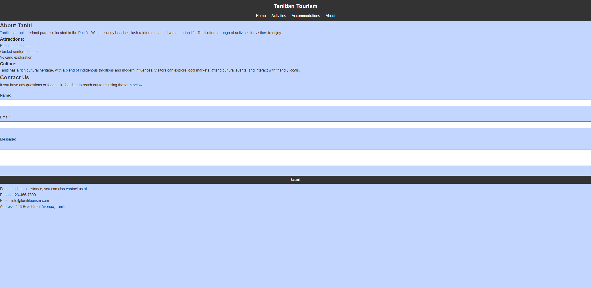

# Tanitian Tourism

## Description

The Tanitian Tourism Website is a comprehensive online platform designed to showcase the beauty and attractions of Tanitian Island. This website aims to provide users with detailed information about the island's culture, history, and natural wonders, as well as practical travel advice and tips.

## Features

- Detailed Information: Explore Tanitian Island's activities and accommodations.
- Dynamic Pages: Easily add new items using a grid layout for flexible content management.
- Contact Page: Contact the island administration for inquiries or assistance.

## Screenshots

#### Home Page

#### Activities Page

#### Accommodations Page

#### About Page

